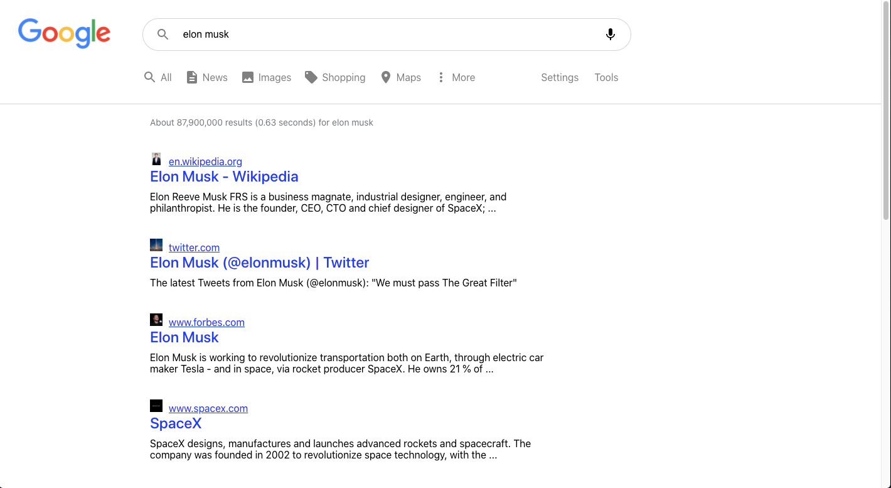

<h1 align = "center">Google Search clone</h1>

<p>&nbsp;</p> 

<p align="center">A  <strong>Search Engine React JS</strong> that is built using the React js and google search api.</p>

<p>&nbsp;</p> 

## Requirements

 (Vertrical_Instructions_Coding_Challenge.pdf)

## Requirements


<p>&nbsp;</p> 



<p>&nbsp;</p> 
<p>&nbsp;</p> 

####  Deployed on firebase:

LIve Link: https://search-engine-cb6e7.web.app/

<p>&nbsp;</p> 

### Getting started

```


$ git clone https://github.com/Maheshoo7/Google-search-clone.git

$ cd google-search-clone/

$ npm install

$ npm start


```
