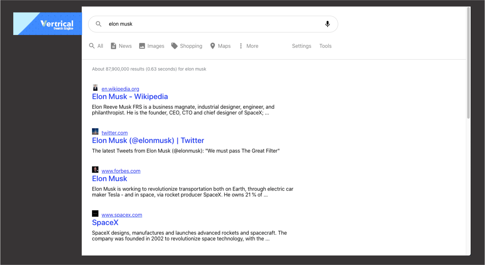

<h1 align = "center">Search Engine React JS</h1>

<p>&nbsp;</p> 

<p align="center">A  <strong>Search Engine React JS <br> <a href="https://vertrical.com/"><span style="font-size:40px;">Vertrical</span></a> Coding Challenge</strong> that is built using the React js and google search api.</p>

<p>&nbsp;</p> 

# Requirements

<!---->
<a href="Vertrical_Instructions_Coding_Challenge.pdf" target="_blank">PDF</a>

## Screenshots


<p>&nbsp;</p> 

<!---->


<p>&nbsp;</p> 
<p>&nbsp;</p> 


####  Deployed on firebase:

LIve Link: https://searchenginevertrical.firebaseapp.com/

<p>&nbsp;</p> 

### Getting started

```


## Deploy Firebase (GCP)
<a href="https://hackernoon.com/how-to-deploy-a-react-application-with-firebase-hosting-p92m37b7">Deploy</a>
firebase login

$ git clone https://github.com/ricaza81/search-engine-vertrical

$ cd google-search-clone/

$ npm install

$ npm start

### note: if you default port is bussy >>> localhost:3000 >> edit the package.json in line >>> "start": "react-scripts start", and update for >>> "set PORT=3200 && react-scripts start",


```
